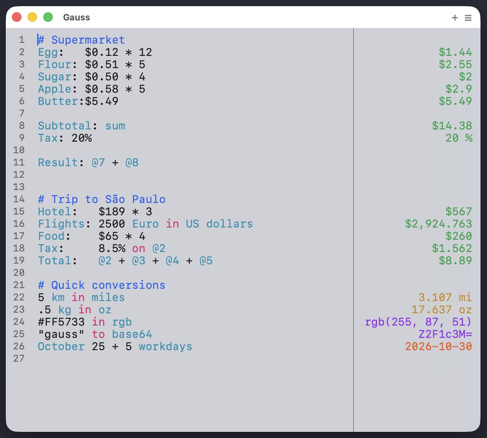

# Gauss

A native macOS menu bar calculator. Multi-line expressions, variables, unit and
currency conversion, color conversion, base64, date math, and syntax
highlighting with autocomplete — all in a floating window summoned by a global
hotkey.



**Free and open source.**


## Download

This fork has no prebuilt releases. Clone the repo and build locally (see
[Build from Source](#build-from-source)). After launch, a calculator icon
appears in the menu bar; press **Ctrl+Space** anywhere to bring up the
floating calculator.

Signed upstream builds (without this fork's changes) are on
[lzhgus/Gauss Releases](https://github.com/lzhgus/Gauss/releases/latest).

## Features

- **Multi-line expressions** — evaluate a whole document at once; each line can
  reference earlier results (`@1 + 2`, `prev`) and variables. Line numbers
  are optional (Preferences → Show Line Numbers).
- **Variables** — `price = 49.99`, then `tax on price`, `price off 10%`, etc.
  Variable names are case-insensitive (`Price` = `price`).
- **Units** — length, mass, temperature, speed, data, and more
  (`5 km in miles`, `100 lb in kg`).
- **Currency** — live FX rates from [frankfurter.app](https://frankfurter.app)
  (`100 USD in EUR`), refreshed periodically.
- **Colors** — hex / RGB / HSL conversion (`#ff5733 in rgb`, `rgb(255,87,51) in hsl`).
- **Base64** — encode and decode (`hello in base64`).
- **Dates & date math** — `now`, date arithmetic, date differences, workdays,
  date ranges.
- **Percentages** — `tax on price`, `discount off total`, `20% of 500`.
- **Syntax highlighting** with autocomplete and ghost-text suggestions.
- **Global hotkey** — **Ctrl+Space** to toggle the calculator from anywhere.

## Changes in this fork

### Added

- Line numbers and `@N` refs
- Vertical separator between notebook and results

### Fixed

- Edit menu missing — Cmd+C/V/X/Z did nothing
- Ghost suggestions overwrote text after cursor; font mismatch shifted text
- Currency names (`US dollars`, `Brazilian Real`, etc.)
- Currency decimals ignored preference
- Leading zero required (`0.5` only)
- Multi-word unit/currency autocomplete (`Brazilian re` → reais, not real)
- Wrapped lines drew over results
- Always on Top covered Preferences
- Hotkey hid a visible unfocused window (now focuses)

## Build from Source

Requires macOS 14.0+, Xcode 16+, and [XcodeGen](https://github.com/yonaskolb/XcodeGen).

```bash
# Install XcodeGen if you don't have it
brew install xcodegen

# Clone and generate the Xcode project
git clone https://github.com/0x3333/Gauss.git
cd Gauss
xcodegen generate

# Run from Xcode
open Gauss.xcodeproj
```

Press **Cmd+R** in Xcode to build and launch. Or build from the command line:

```bash
xcodebuild -scheme Gauss -configuration Debug build
```

Engine tests: `cd GaussEngine && swift test`.

## Architecture

Gauss has two modules:

- **GaussEngine** (`GaussEngine/`) — a Swift Package with the calculation
  engine, independent of AppKit/UI. Pipeline:
  `input → Tokenizer → Matcher (parser) → Evaluator → Value`.
  - `Core/` — `Tokenizer`, `Matcher`, `Evaluator`, `Context`, `CompletionProvider`
  - `Types/Value.swift` — result types (number, currency, date, color, …)
  - `Converters/` — unit, currency, color, base64, timestamp
  - `Resources/definitions/` — JSON data for units, currencies, functions, operators
  - `Formatting/ValueFormatter.swift` — formats `Value` for display
  - Public API: `GaussEngine.evaluateLine(_:lineIndex:)` /
    `evaluateDocument(_:)`

- **Gauss app** (`Gauss/`) — the macOS app, AppKit + SwiftUI hybrid.
  - `App/AppDelegate.swift` — lifecycle, window management
  - `App/MenuBarController.swift` — menu bar status item
  - `Views/CalculatorWindow.swift` — the floating calculator window
  - `Views/CalcTextView.swift` — `NSTextView` subclass with syntax highlighting
    and ghost-text autocomplete
  - `Views/ResultView.swift` — per-line result display
  - `Controllers/Settings.swift` — `UserDefaults`-backed preferences
  - `Controllers/CurrencyUpdater.swift` — periodic FX rate refresh
  - `Controllers/SyntaxHighlighter.swift` — token-based syntax coloring

### Dependencies (Swift Package Manager)

- [KeyboardShortcuts](https://github.com/sindresorhus/KeyboardShortcuts) — global hotkey
- [Sparkle](https://github.com/sparkle-project/Sparkle) — auto-update with EdDSA signing
- **GaussEngine** — local package

## Releasing

Releases are built, signed with a Developer ID, notarized, and published by
GitHub Actions on tag push. See [RELEASING.md](RELEASING.md) for the full
process and the required repository secrets.

## Contributing

Pull requests are welcome. For anything beyond small fixes, please open an
issue first to discuss what you'd like to change.

## License

[MIT](LICENSE) — free for personal and commercial use.
